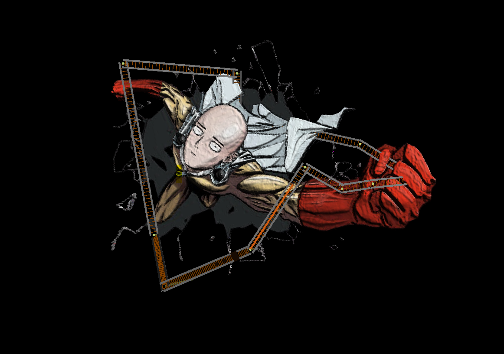
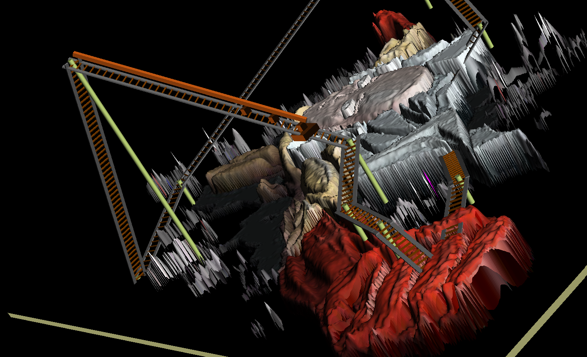
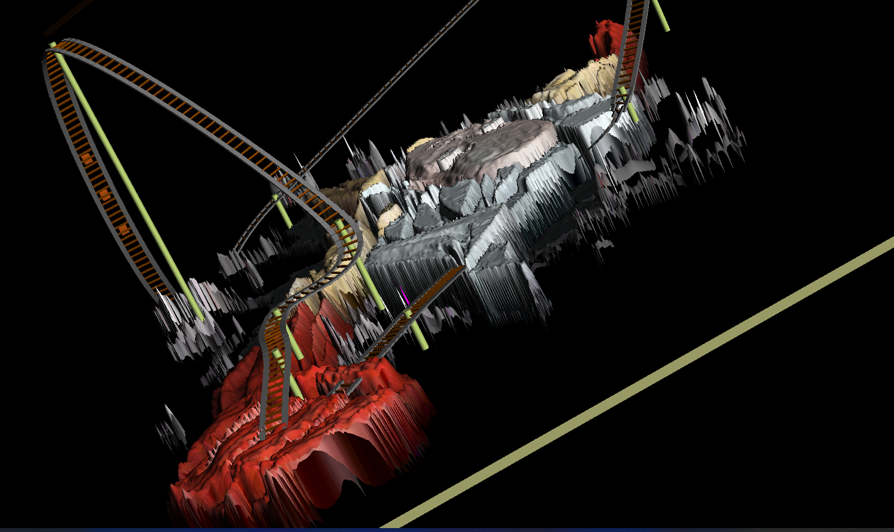

A rollercoaster simulation that advances along a track. The track is defined by a spline, and the cars are drawn using basic Cube and Cylinder classes. The cars move up and down the track according to a physics model of motion.

The rollercoaster scene terrain is a texture of One-Punch Man, depth-scaled according to intensity values. 

