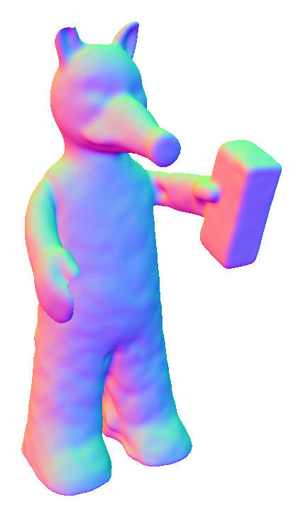
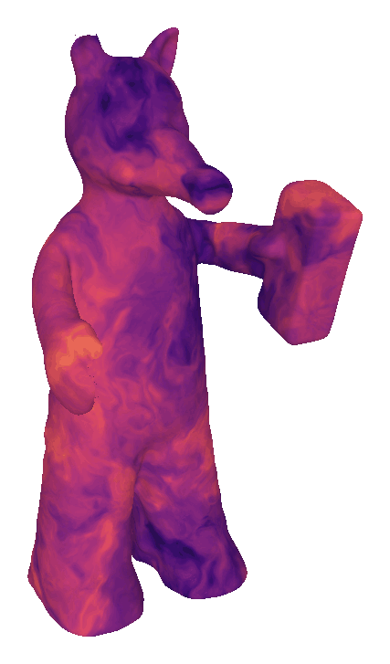

  
  

As part of my Master's project, I'm working on 3D reconstruction of shapes via neural signed distance functions (SDFs). These are useful for sphere tracing (stepping along a ray by spheres with radius determined by the field). The [**codebase**](https://github.com/Galaxeaaa/HotSpot/tree/main) I'm using provides a ready-to-go sphere tracer which they use to compute renders of the surface, normal maps and heatmaps of intersections with the surface. I used this sphere tracer to identify the surface of the neural field and add texture; Fractional Brownian Motion inspired by [**Inigo Quilez**](https://iquilezles.org/articles/fbm/). Points on the surface are perturbed and coloured according to the noise added, creating swirling patterns. Using normals obtained through autograd of the neural distance field, I add simple diffuse shading to improve the appearance of the 3D object. 

<!-- Final result:
 -->

<!-- 
Without diffuse shading:
 -->

